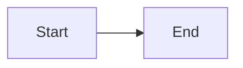

# Documentation Quick Reference

## Viewing Documentation

### Serve Locally (Recommended for Development)
```bash
mkdocs serve
```
Open http://127.0.0.1:8000 in your browser.

Any changes to `.md` files will automatically reload!

### Build Static Site
```bash
mkdocs build
```
Creates `site/` directory with HTML files.

## Common Commands

```bash
# Clean build
mkdocs build --clean

# Serve on different port
mkdocs serve -a 127.0.0.1:8001

# Deploy to GitHub Pages
mkdocs gh-deploy

# Check MkDocs version
mkdocs --version
```

## Project Structure

```
gexter/
├── mkdocs.yml              # Configuration file
├── docs/                   # Documentation source
│   ├── index.md           # Homepage
│   ├── quickstart.md      # Quick start guide
│   ├── api/               # API reference
│   ├── stylesheets/       # Custom CSS
│   └── javascripts/       # Custom JS
└── site/                  # Generated static site (gitignored)
```

## Adding New Pages

1. Create `.md` file in `docs/`
2. Add to navigation in `mkdocs.yml`:
   ```yaml
   nav:
     - New Section:
         - Page Title: filename.md
   ```
3. Preview: `mkdocs serve`

## Deployment

### GitHub Pages (Free Hosting)

**One-time setup:**
```bash
mkdocs gh-deploy
```

**Automatic (via GitHub Actions):**
- Already configured in `.github/workflows/docs.yml`
- Deploys automatically on push to `main`
- View at: `https://yourusername.github.io/gexter/`

### Read the Docs

1. Go to https://readthedocs.org
2. Import your GitHub repository
3. Builds automatically on each push
4. View at: `https://gexter.readthedocs.io`

## Markdown Features

### Admonitions
```markdown
!!! note
    This is a note

!!! warning
    This is a warning

!!! tip
    Helpful tip here
```

### Code Blocks
````markdown
```python
def hello():
    return "World"
```
````

### Mermaid Diagrams
````markdown

````

### Auto-generate API Docs
```markdown
::: src.gex_collector
```

## Customization

### Update Site Info
Edit [mkdocs.yml](../mkdocs.yml):
```yaml
site_name: Your Project Name
site_url: https://yoursite.com
repo_url: https://github.com/yourusername/yourrepo
```

### Custom Styling
Edit [docs/stylesheets/extra.css](stylesheets/extra.css)

### Custom JavaScript
Edit [docs/javascripts/extra.js](javascripts/extra.js)

## Troubleshooting

**Port in use:**
```bash
mkdocs serve -a 127.0.0.1:8001
```

**Build errors:**
```bash
mkdocs build --clean
```

**Missing dependencies:**
```bash
pip install -r requirements.txt
```

## Resources

- [Full Setup Guide](DOCUMENTATION_SETUP.md)
- [MkDocs Documentation](https://www.mkdocs.org)
- [Material Theme](https://squidfunk.github.io/mkdocs-material/)
- [Markdown Guide](https://www.markdownguide.org)
