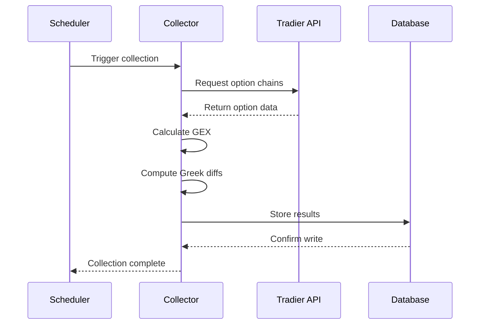

# GEX Collector API Reference

The GEX Collector is the core module responsible for collecting option chain data from the Tradier API and calculating gamma exposure metrics.

## Module: `gex_collector`

::: src.gex_collector

## Key Functions

### Main Collection

The main collection function runs on a scheduled basis to gather option data:

```python
def collect_gex_data():
    """
    Collects SPX option chain data and calculates GEX metrics.

    This function:
    1. Fetches current SPX option chains from Tradier
    2. Calculates gamma exposure for each strike
    3. Computes Greek differences vs previous collection
    4. Updates technical indicators (EMAs)
    5. Stores everything in PostgreSQL

    Returns:
        bool: True if collection was successful
    """
```

### GEX Calculation

Gamma exposure is calculated using the formula:

```
GEX = Gamma × Open Interest × Contract Multiplier × Spot Price
```

For calls: Positive GEX (dealers are short gamma)
For puts: Negative GEX (dealers are long gamma)

## Data Flow



## Configuration

The collector uses environment variables for configuration:

| Variable | Description | Default |
|----------|-------------|---------|
| `TRADIER_API_KEY` | Tradier API authentication key | Required |
| `TRADIER_ACCOUNT_ID` | Tradier account identifier | Required |
| `COLLECTION_INTERVAL_MINUTES` | How often to collect data | 5 |
| `TRADING_HOURS_START` | Market open time (ET) | 09:30 |
| `TRADING_HOURS_END` | Market close time (ET) | 16:00 |

## Database Schema

The collector writes to the `gex_table` with composite primary key:

- `greeks.updated_at` (timestamp)
- `expiration_date` (text)
- `option_type` (text - 'call' or 'put')
- `strike` (real)

### Key Columns

**Option Metadata:**
- `symbol`, `description`, `expiration_type`
- `root_symbol`, `underlying`

**Price Data:**
- `last`, `bid`, `ask`
- `open`, `high`, `low`, `close`

**Volume & Interest:**
- `volume`, `open_interest`
- `trade_date`, `last_volume`

**Greeks:**
- `delta`, `gamma`, `theta`, `vega`, `rho`
- `phi`, `bid_iv`, `mid_iv`, `ask_iv`, `smv_vol`

**GEX Calculations:**
- `gex` - Gamma exposure for the strike
- `net_gex` - Net GEX considering call/put direction

**Greek Differences:**
- 24 columns tracking changes in Greeks over time
- Both absolute and percentage changes

**SPX Tracking:**
- `spx_price`, `spx_open`, `spx_high`, `spx_low`, `spx_close`
- `spx_volume`

## Error Handling

The collector includes robust error handling:

```python
try:
    # Collect data
    result = collect_gex_data()
except TradierAPIError as e:
    logger.error(f"Tradier API error: {e}")
    # Retry logic
except DatabaseError as e:
    logger.error(f"Database error: {e}")
    # Alert and rollback
except Exception as e:
    logger.error(f"Unexpected error: {e}")
    # Log and continue
```

## Usage Examples

### Manual Collection

```python
from src.gex_collector import collect_gex_data

# Run a single collection
success = collect_gex_data()
if success:
    print("Data collected successfully")
```

### Custom Schedule

```python
from src.scheduler import Scheduler
from src.gex_collector import collect_gex_data

# Create custom schedule
scheduler = Scheduler()
scheduler.every(10).minutes.do(collect_gex_data)
scheduler.run()
```

### Accessing Collected Data

```python
from src.database import Database

db = Database()

# Get latest GEX data
query = """
    SELECT strike, option_type, gex, open_interest
    FROM gex_table
    WHERE greeks.updated_at = (SELECT MAX(greeks.updated_at) FROM gex_table)
    ORDER BY ABS(gex) DESC
    LIMIT 10
"""

top_gex = db.execute(query)
```

## Performance

The collector is optimized for efficiency:

- **Collection time**: ~5-10 seconds per run
- **Database writes**: Batched inserts for speed
- **API calls**: Minimized to stay within rate limits
- **Memory usage**: ~50-100MB during collection

## Logging

Comprehensive logging tracks all operations:

```
2024-11-29 09:30:00 - INFO - Starting GEX collection
2024-11-29 09:30:02 - INFO - Fetched 500 option contracts
2024-11-29 09:30:05 - INFO - Calculated GEX for all strikes
2024-11-29 09:30:08 - INFO - Stored 500 records in database
2024-11-29 09:30:08 - INFO - Collection complete
```

Logs are stored in:
- Console output (during development)
- `logs/gex_collector.log` (in production)
- Docker logs (when containerized)

## See Also

- [Database Module](database.md) - Database interface and schema
- [Scheduler Module](scheduler.md) - Collection scheduling
- [Tradier API](https://documentation.tradier.com/) - Official API docs
