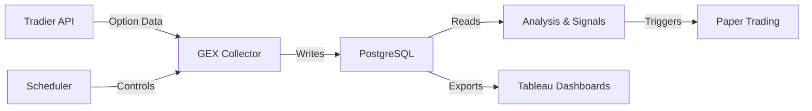

# GEXter - Gamma Exposure Data Platform

Welcome to the GEXter documentation! GEXter is a production-ready, containerized system for collecting SPX option chain data and calculating gamma exposure with comprehensive technical analysis.

## What is GEXter?

GEXter collects real-time option market data to identify significant gamma exposure levels that can influence market behavior. By analyzing option positioning, GEXter helps traders understand where market makers may need to hedge their positions, creating potential support and resistance levels.

## Key Features

- **Real-time SPX Option Data Collection** from Tradier API
- **Gamma Exposure (GEX) Calculation** for each strike and expiration
- **Greek Differences Tracking** with 24 comparison metrics
- **SPX Price Integration** with OHLC intraday data
- **Technical Indicators** including 8-period and 21-period EMAs
- **PostgreSQL Database** with optimized schema and indexing
- **Docker Deployment** with Docker Compose orchestration
- **Automated Scheduling** with configurable collection intervals
- **Paper Trading Support** via Tradier integration

## Quick Links

-   :material-rocket-launch:{ .lg .middle } __Getting Started__

    ---

    Get up and running quickly with our comprehensive guides

    [:octicons-arrow-right-24: Quick Start](quickstart.md)

-   :material-chart-line:{ .lg .middle } __Trading Strategies__

    ---

    Learn about our gamma-based trading strategies

    [:octicons-arrow-right-24: Strategy Overview](STRATEGY_WHITEPAPER.md)

-   :material-cog:{ .lg .middle } __Deployment__

    ---

    Deploy GEXter to production environments

    [:octicons-arrow-right-24: Deployment Guide](deployment_guide.md)

-   :material-api:{ .lg .middle } __API Reference__

    ---

    Explore the codebase and API documentation

    [:octicons-arrow-right-24: API Docs](api/gex_collector.md)

## How It Works

1. **Data Collection**: GEXter automatically collects SPX option chain data during market hours (9:30 AM - 4:00 PM ET)
2. **GEX Calculation**: For each strike and expiration, gamma exposure is calculated based on open interest and Greek values
3. **Analysis**: Technical indicators and Greek differences are tracked over time to identify trends
4. **Signal Generation**: Trading signals are generated based on 0DTE gamma levels and market positioning
5. **Paper Trading**: Test strategies with real-time data using Tradier's paper trading environment

## Architecture Overview

## Use Cases

### For Traders
- Identify key support/resistance levels based on gamma positioning
- Generate 0DTE trading signals for SPX/SPY
- Backtest strangle strategies with historical GEX data
- Monitor real-time option market dynamics

### For Researchers
- Study the relationship between gamma exposure and price action
- Analyze Greek differences and their predictive power
- Research market maker hedging behavior
- Validate options pricing models

### For Developers
- Clean, well-documented Python codebase
- Docker-based deployment for easy scaling
- RESTful API integration patterns
- PostgreSQL schema optimized for time-series data

## Project Status

**Status**: Production Ready ✅

- **Version**: 1.0
- **Last Updated**: November 2024
- **Python Version**: 3.13+
- **Database**: PostgreSQL 15

## Support

For issues, questions, or contributions:

- **Issues**: [GitHub Issues](https://github.com/yourusername/gexter/issues)
- **Documentation**: You're reading it!
- **Email**: your.email@example.com

## License

This project is for personal use. Tradier API usage is subject to their terms of service.

---

  
<strong>Ready to get started?</strong>

  
<a href="README.md" class="md-button md-button--primary">Quick Start Guide →</a>

